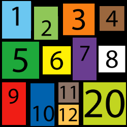

# Word Counter App
https://dong-yi-xia.github.io/word_counter/

1. Character Count
2. Word Count
3. Sentence Count
4. Paragraph Count
5. Bigrams (counts of unique pairs of words)



# SetUp


# Dependencies
BootStrap
- https://react-bootstrap.github.io/getting-started/introduction

Scss
- https://www.npmjs.com/package/node-sass

TTS
- https://www.npmjs.com/package/speak-tts


# Resources 
- https://mixkit.co/free-sound-effects/typewriter/


## Extra Way using the Voice RSS API
- http://www.voicerss.org/api/
- https://www.w3schools.com/tags/ref_av_dom.asp


Another way on using TTS is with the new Audio. Replace key=APIKEY and src=TEXT
```
<button onClick={(e)=>{
        let music = new Audio('http://api.voicerss.org/?key=123456789&hl=en-us&src=Hello, world!')
        music.play()
    }}>
Listen</button>
```